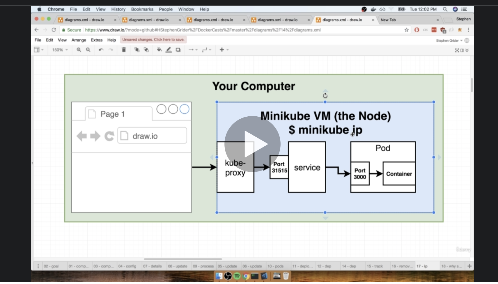
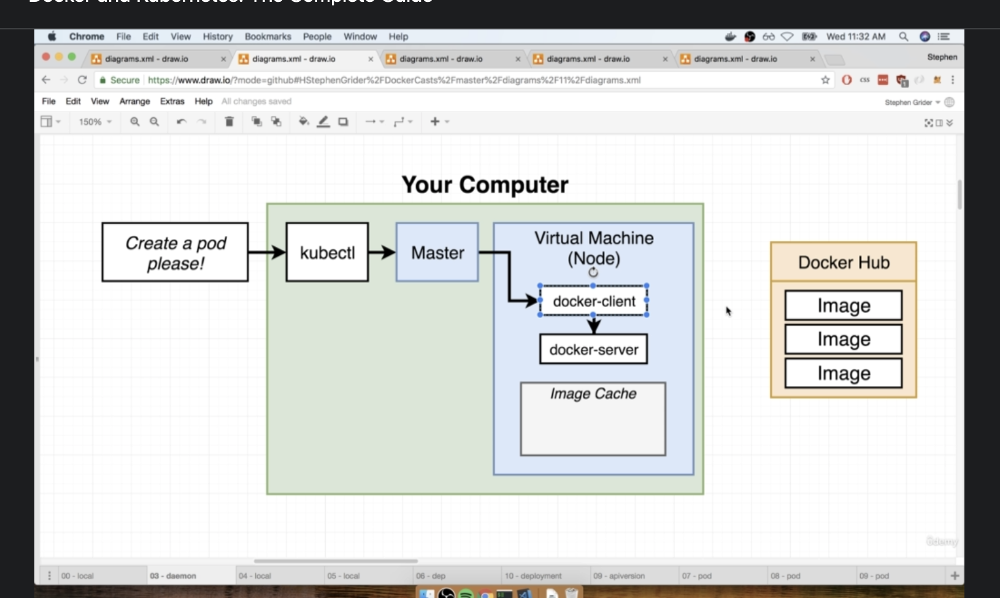
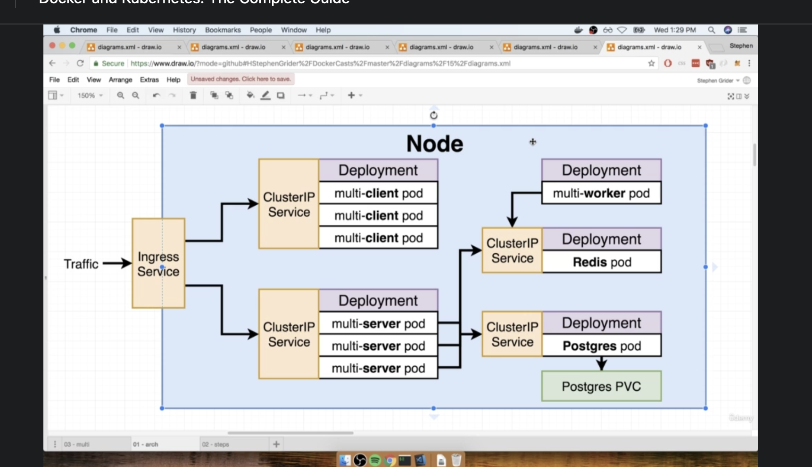
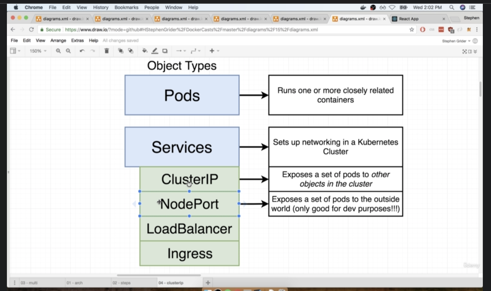
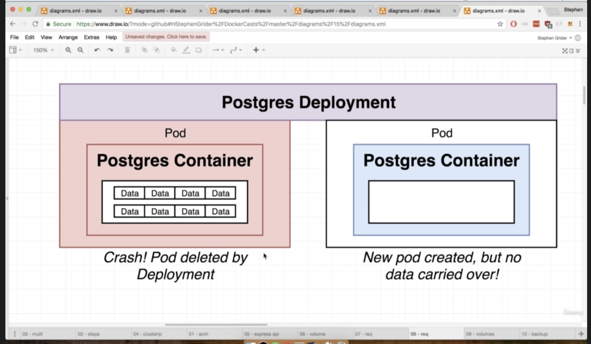
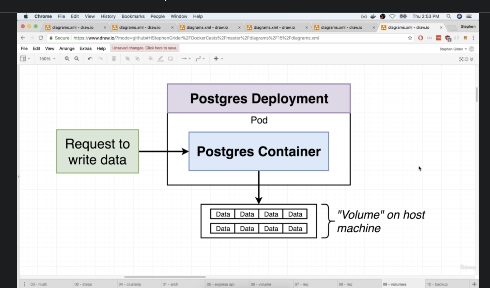
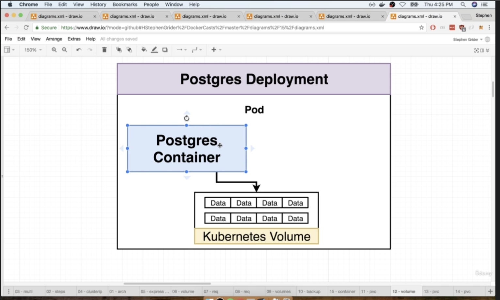

# Udemy docker and kubernetes course notes

## 14. Docker run in detail

## 15. Overriding default commands

Override the default command with our command
`docker run <image name> command`.
e.g. `docker run busybox echo hi there`. More useful: "ls" as the command. Which commands are available? Depends on the image.

## 16. Listing running containers

`docker ps`  # shows running containers
(Run `docker busybox ping google.com` to get something running.)

### Include containers that have shutdown

`docker ps --all`

## 17. Container lifecycle

docker run = docker create + docker start

`docker create <image_name>`  # create a container from an image. i.e. set up filesystem snapshot that will be used to create the container.
`docker start <container_id>`

`docker create` returns an id. Can be passed into `docker start -a <container_id>`. -a Attach STDOUT/STDERR and forward signals.

## 18. Restarting stopped containers

`docker start -a <container_id>`

QUESTION: Does docker run create a new image if one already exists?

You can't replace the command of a container you already started before.

## 19. Removing stopped containers

`docker system prune`

## 20. Retrieving log outputs

`docker logs <container_id>`

## 21. Stopping containers

`docker stop <container_id>` (SIGTERM, ask it politely to shudown and clean itself up) or `docker kill <container_id>` (SIGKILL).

Note that docker stop times out at 10 seconds and issues a sigkill by itself.

## 22. Multi-command container (intro)

`docker run redis` Run redis server.

How to run the redis-cli in the same running container?

## 23. Executing commands in running containers

`docker exec -it <container_id> <command>`

-it allows us to provide input directly into the container.

So we can start redis server: `docker run redis`, and then to get to the
cli, `docker exect -it <id> redis-cli`

## 24. The purpose of the -it flag

Need to know more about how linux processes work. Recall that all of our docker containers are running inside of a linux virtual machine. The STDIN, STDOUT, STDERR channels are attached to running processes. -i attaches what we type into our terminal to the STDIN of the process we're going to run. The -t flag routes STDOUT and STDERR to our terminal.

## 25. Getting a command prompt in a container

`docker exec -it <container_id> sh`

## 26. Starting with a shell

You could always run `docker run -it <image_name> sh`, replacing the command with sh.

## 27. Container isolation

Just points out that containers don't share file systems with each other.

## 28. Creating docker images

Create a docker file, pass it to the docker client, which passes it to the docker server, which creates an image.

### Create a Dockerfile
1. Specify a base image
2. Run some commands to install additional programs.
3. Specify a command to run at container startup

## 29. Buildkit for Docker Desktop

This is a text module. It says the output will be different if you have buildkit, but doesn't explain the significance of it. 

## 30. Building a dockerfile

Goal is to create an image that runs redis. Made a directory redis-image.
Dockerfile is the name of the file. Run `docker build .` in the same directory as the Dockerfile.

## 31. Dockerfile teardown

(Explains the contents of the docker file)

## 32. What's a base image?

## 33. The build process in detail

`docker build .` The dot specifies the "build context".

## 35. Rebuilds with cache

## 36. Tagging an image

`docker build -t dantheman39/redis:latest .` You can omit :latest. Technically what's after the colon is the tag. dantheman39 is the repo / project name.

QUESTION: Can we tag an image after building it?

## 38. Manual image generation with docker commit

Recall that for each step in our docker build process, docker is creating intermediate containers, and eventually outputs an image (from which containers could be created...). We could do this manually: create a container, run a command, then generate an image from it. For example, run sh on alpine (`docker run -it alpine sh`), run a command to add redis (`apk add --update redis`), and then in another terminal window, run:

```
docker commit -c 'CMD ["redis-server"]' <container_id>
```

And this creates a new image.

# Section 4: Making real projects with Docker

## 40. Node server setup

simpleweb is the name of the directory

## 41. A few planned errors

## 42. Node version errors note.

Resolution:

```docker
FROM node:alpine

WORKDIR /usr/app
```

## 43. Ports

Map any ports you need to access with -p 8080:8080 (works for docker run, docker create, prolly others).

## 45. Copying build files

`COPY ./ ./`

## 48. Specifying a working directory

Use WORKDIR, to not install all your stuff in the root of the container. (i.e. `WORKDIR /usr/app`)

## 50. Minimizing cache busting and rebuilds

Sample problem: we changed our source code but not our dependencies. We don't want to have to reinstall everything every time.

The solution in this case is instead of copying all of the files, copy just the package.json, then npm install, then copy everything else.

General idea is to copy the minimum amount of files needed for each step to take advantage of the cache. 

# Section 5. Docker compose and multiple local containers

Building a node app that counts number of visits in redis. We want redis and node in separate containers so that multiple instances of the app don't have different numbers of visits.

Project is called visits.

## 54. Introducing Docker Compose

Streamlines setting up networking and running multiple containers.

## 55. Docker compose files

See visits/docker-compose.yml

## 56. Networking with docker compose

Docker compose allows containers to talk to each other, so no config is required right now. In our (redis).createClient() we can pass "redis-server", the name of the service defined in docker-compose.yml, instead of a url, as the host.

## 57. Docker compose commands

`docker run <my_image> -> docker-compose up`
`docker build . ; docker run <my_image> -> docker-compose up --build`

## 58. Stopping docker compose containers

Launch a group of containers in the background:

`docker-compose up -d` 

To shut them down:
`docker-compose down`

## 59. Container maintenance with compose

What to do when one container exits?

## 60. Automatic container restarts

Restart policies:
  - "no"
  - always
  - on-failure
  - unless-stopped  (always attempt to restart unless the developer stops it)

## 61. Container status with docker compose

`docker-compose ps` Note that this works relative to your working directory.

Running from another directory without a docker-compose.yml will raise an error.

# Section 6. Creating a production-grade workflow

Using frontend directory

## 69. Creating Dev dockerfile

We're going to create a dockerfile for development and production

Run docker build with a different file:

`docker build -f Dockerfile.dev .`

## 70. Duplicating dependencies

He recommends deleting node_modules, but I'm just going to add a .dockerignore file.

Speeds up the build significantly.

## 73. Docker volumes

Looks like he's doing something like HMR in his build. Instead of COPYing, we're going to use "docker volumes". We're setting a reference that points back to files on our machine.

`docker run -p 4001:1234 -v /usr/app/node_modules -v $(pwd):/usr/app <image_id>`

Looking at second -v switch, it says map present working directory to /usr/app in our container.

The first switch doesn't have a colon. Why is it necessary?

## 75. Bookmarking volumes

The first -v with no colon, says use the one in the container. As in, don't try to map it.

## 77. Shorthand with docker-compose

Instead of using that crazy long command, we can use docker-compose

## 78. Overriding dockerfile selection

See updated frontend/docker-compose.yml . Note that I needed to add stdin_open: true, as they noted in their notes.

## 83. Docker compose for running tests

You can add another service in docker-compose.

## 86. Shortcomings on testing

The logs from both containers appear in one terminal. His test suite offered interactivity, and he can't get to it. You can't do it in docker compose + npm. He gives a very good explanation as to why.

## 87. Need for nginx

## 88. Multi-step docker builds

We don't actually need the react dependencies after we transpile our app. We only need to keep the build / dist folder. We also need nginx. We'd like to take the result of the "build" phase (from node), and then copy into the "run" phase (from nginx). See frontend/Dockerfile.

# Section 7: Continuous integration and deployment with AWS

We're going to use Travis CI and AWS.

I created a repo docker-react and added it as a submodule to the docker-course repo

## 100. Creating AWS Elastic Beanstalk application

# Section 8: Building a multi-container application

New repo is called docker-course-complex (or docker-course-multi-container?). We're going to build an application that has a database, uses multiple containers, and we're not going to build the docker image from within the webserver itself.

## 117. Application architecture

Application overview: 

How we're using postgres and redis: 

Flow: 

## 138. Postgres required fixes

`docker-compose down && docker-compose up --build`

## 142. We're going to use nginx for our development setup.

Pretty baller

# Section 10: CI workflow for multiple containers

# Section 11: Multi-container deployments to AWS

Elastic beanstalk will rely on a Dockerrun.aws.json, which is similar to a docker-compose, but it the former has instructions on building an image, whereas the latter just runs an image.

## 162. Finding docs on container definitions

Turns out elastic beanstalk will run its containers on ECS, so look for ECS task definitions, then find Container Definitions

## 164. More container definitions

Note that at least one container should be marked as "essential".

# NOTE: I've skipped part of this final section because I want to get going with K8S

# Section 12. Kubernetes

## 178. Why use kubernetes?

What happens if we want to scale? In our app, the worker would be doing the brunt of the work.
How would Elastic Beanstalk scale? It would scale all of our containers equally. With kubernetes
we could do something like create a bunch of workers, but leave the number of nginx containers
the same.

A "cluster" in kubernetes, has an assembly of a "master", and one or more "nodes". Node is a VM
or physical computer, which can run one or more containers.

Outside of and in front of our cluster, there is a load balancer which will relay requests to our
nodes.

Kubernetes is appropriate when we want to have many containers run in different quantities on
different computers.

## 179. K in dev and prod

In dev we use minikube. It will create a little cluster for us. In prod we use "managed solutions".
These reference outside providers like AWS (EKS) or GCP (GKE). You could also do it yourself.

minikube will create a VM (a node) that can run multiple containers. `kubectl` is the command line
program we will use to interact with it. minikube is only used locally.

Install kubectl, then a vm driver (virtualbox), and then minikube.

## 181. Running minikube

Run `minikube start`. `minikube status` to see how it's doing.

## 186. Mapping Existing knowledge

|Docker compose | Kubernetes |
|---------------|------------|
|Each entry can get docker-compose to build an image | K expects all images to already be built |
|Each entry represents a _container_ we want to create | One config file per _object_ we want to create |
|Each entry defines the networking requirements (ports) | We have to manually set up all networking |

## 188. Adding configuration files

Steps to get running:
- Make sure image is hosted on dockerhub
- Make one config file to create the container
- Make one config file to create the networking

See `simplek8s/client-pod.yaml` and `simplek8s/client-node-port.yaml`.

## 189. Object types and API versions

What is an object? Our config files will be used to create an object, which is a thing
that we will put in our cluster to make it work. We create
object types. For example, a StatefulSet, or a ReplicaController, or a Pod, or
a Service. Note the "kind" field in our configuration files.

Pods control containers, Services control networking.

## 190. Running containers in pods

When we ran minikube start, it created a new VM for us. That VM is known as a Node.
The node will be used by Kubernetes to run some number of different objects.

One of the most basic objects we will create is a Pod. We will give kubectl
our config file, telling it to create a Pod inside of our Node.

A Pod is a grouping of containers with a very common purpose. In kubernetes, you
can't just run a naked container, you run it within a Pod, which is the smallest
thing that we can deploy.

A Pod contains containers that have a very common purpose: containers that
need to be deployed together for our application to work. A good example of running
a pod with multiple containers, is a pod that has three containers, a postgres container
(primary), and a logger container and a backup manager container (support containers).
We need all of these for our database to work correctly. If our postgres container
goes away, the backup-manager won't work, and the logger container can't write logs
without the postgres container.

## 191. Service config files in depth

See client-node-port.yaml. This sets up networking in a Kubernetes cluster.

Services have 4 sub-types: You can create a Service of type ClusterIP, NodePort,
LoadBalancer or Ingress. We're creating a NodePort Service. It exposes a container
to the outside world. A NodePort is only good for development purposes, we almost
never use it in production.

Our web browser will connect to a K8S Node VM running on our machine, created by
minikube. In the Node, we go through the kube-proxy, then the NodePort Service, which
points to the Pod: within the pod we're sent to port 3000, which gives us access to
our multi-client container.

Note that we specified three ports in our file. How does it link back to our Pod?
Note the "selector.component: web". It uses the "Label selector system". Note that
"component: web" is totally arbitrary. We could have called it "tier: frontend".

Why three ports? "port" is what another container in a different pod within our cluster
would use to connect to the multi-client pod. In our case we're not going to use it.
The targetPort is the port on the pod that we're going to route to. The nodePort is
the port we'll put in our browser when we want to get to the damn thing.

nodePort is a number between 30000-32767. If we don't specify it, it will be created
randomly for us within that range.

## 192. Connecting to running containers

Make sure minkube has started our VM.

`kubectl apply -f <configfilename>`

We're going to run this twice, once for each file.

Let's see if they were successfully created. We'd run `kubectl get <type_of_object>`.

`kubectl get pods`, `kubectl get services`.

How to access it in the browser? We need to get the IP address of the VM created
by minikube. `minikube ip`

## 193. The entire deployment flow

We don't work directly with the nodes, we work with the master. We apply configuration files, and then the master will tell our nodes to start up some containers. Each node has a copy of docker on it, and it will go fetch the container it is told to. The master periodically checks that our nodes are up and running the containers that the master told them to.

## 194. Imperative vs. Declarative deployments

# Section 13: Maintaining sets of containers with deployments

## 195. Updating existing objects

Let's update our existing pod to use the "multi-worker" image we created, instead of the "multi-client" one that it's currently using. We're going to update our config file and apply it.

How does k8s know to update an object and not create a new one? It looks at name and kind.

## 196. Declarative updates in action

Note that it's going to crash without redis. We don't care right now.

How can we get the status of the single pod after running `kubectl apply -f client-pod.yaml`?

`kubectl describe <object_type> <object_name>`
`kubectl describe pods client-pod`

## 197. Limitations in config updates

We're going to change the containerPort and try to update. However we're going to get an error. We're only allowed to change a small set of things on a pod.

## 198. Running containers with deployments

To be able to make any changes we want to pods, we're going to learn to use a new type of object. We're going to use a Deployment. A Deployment is an object that maintains a set of pods, ensuring they have the correct config and that they are in the desired state.

How is it different from a pod? Both can run containers.

| Pod | Deployment |
|-----|------------|
| Runs single set of containers. | Runs a set of identical pods |
| Good for one-off dev purposes | Monitors the state of each pod, updating as necessary|
| Rarely used in production | Good for dev |
| | Good for prod |

A Deployment has a pod template attached to it.

## 199. Note

Use stephen's image instead of ours to avoid some error: stephengrider/multi-client

## 200. Deployment configuration files

See simplek8s/client-deployment.yaml

## 201. Walking through the config

The `template` section is the configuration that is going to be used
by every single pod in this deployment.

Replicas specifies the number of pods this deployment is supposed to make.

The `selector` is what can be used for kubectl to be able to request information
from the master about that pod. `selector.matchLabels` corresponds to
`template.metadata.labels`.

## 202. Applying a deployment

First, delete any previously running pods:

`kubectl delete -f <config_file>`. Note that this is an imperative command
sent to our cluster, we can't really get around that.

## 203. Why use services?

We try to connect to our deployment. Run `minikube ip` to find the IP of
the VM.



(Note that he's expecting the client-node-port service to have been applied).

Run `kubectl get pods -o wide` for a little more info. Note that this pod
has an IP assigned to it. The IP address is internal to our VM, and its address
can be different if it has to restart, etc.

Note that using minikube with the docker driver borks using NodePort.
See [issue](https://github.com/kubernetes/minikube/issues/11193).
This is the flow one would expect to use:

```
minikube ip
> 192.1.1.25
kubectl describe service client-node-port
# Look for NodePort

# In browser
# 192.1.1.25:31515 <- client-node-port.nodePort
# Success! But not.

# The fix is to either switch to using VMs, or do:
minikube service --url client-node-port
# It will start a tunnel for you
```

## 204. Scaling and Changing Deployments

We're going to try changing the containerPort in the deployment.

Apply it. Note that the output message says "configured" and not "created."
Also not that `kubectl get pods` shows that the pod was deleted and recreated
(only been alive for a few seconds). Describe the pod to confirm that it's
using the new port.

Let's scale up to 5 (change replicas). If you can run `get deployments` fast
enough, you may note that you can have more than 5 pods running while it
brings up the new ones and spins down the old ones.

## 205. Updating deployment images

What happens when you have a new version of an image? How do you make
the deployment use the new image? (not answered here, see following sections).

## 206. Rebuilding the Client image

## 207. Triggering deployment updates

Note that it's surprisingly hard to get a deployment to use the latest version
of an image. See [this issue](https://github.com/kubernetes/kubernetes/issues/33664).
We're using the "latest" image, but applying an unchanged file causes nothing to happen.

He suggests three solutions.

1. Manually delete pods.
 
This is not great at all.

2. Use image tag.
 
Requires code change.

3. Use an imperative command to update the config.

This makes the config file go out of date with our config file.

He prefers 3.

## 208. Imperatively Updating a Deployment's Image

Tag the image with a version number, then run kubectl to change the deployment
to use the new image:

`kubectl set image deployment/client-deployment client=stephengrider/multi-client:v5`

## 210. Multiple docker installations

He has a bunch of things running in `docker ps`.



Note that if you're running minikube, you have two copies of docker. One
that you're using for docker commands, and one inside the VM created by minikube.

## 211. Reconfiguring docker cli

Optional of course. Run `eval $(minikube docker-env)`. This only applies only
for the current bash session.

## 212. Why mess with docker in the node?

- You can use debugging techniques to inspect containers, get logs from them.
  (Although this is practically all available via kubectl)
- Manually kill containers to test kubernetes's "self-healing".
- Delete cached images in node. `docker system prune -a`

# 14. A Multi-container app using kubernetes

## 213. The Path to Production



See complex2/ , which holds all of the files for the different
images we built.

## 216. Recreating the deployment

I copied things from complex-elastic-beanstalk to complex-k8s.
We're going to delete stuff.

Wrote complex-k8s/k8s/client-deployment.yaml .

## 217. NodePort vs ClusterIP Service



A NodePort exposes one or more pods to the outside world, it's
not appropriate for development. A ClusterIP allows objects to
talk to other objects within the cluster, but doesn't let the
outside world in.

## 218. The ClusterIP config

See client-cluster-ip-service.yaml

## 219. Applying multiple files at once

You can pass in a directory:

`kubectl apply -f k8s`

## 220. Express API Deployment Config

Note that later we will have to add some environment variables.

## 221. ClusterIP for the Express API

(see server-cluster-ip-service.yaml)

## 222. Combining configs into single files

We could create one file for a ClusterIP service and a Deployment.
You add `---` on a line to separate the different configs.

## 223. Worker deployment

Nothing needs to connect to this, so no service, no ports.

## 225. Creating and applying redis

## 227. Postgres deployment

## 228. The need for Volumes with databases

What is Postgres PVC in our architecture chart? Persistent Volume Claim.

If we just use our postgres container as written up until this point,
if the container crashes, we lose all of the data.

### Bad



### Good (with volumes)



A volume is a filesystem on a host machine, and postgress will write to that
instead of to the filesystem in the container.

## 229. Kubernetes Volumes

"Volume" in generic container terminology: Some type of mechanism that allows a
container to access a filesystem outside itself.

"Volume" in kubernetes: An **object** that allows a container to store data
at the pod level.

This is not the same as a Persistent Volume Claim and a Persistent Volume.
A Volume is not appropriate for data that we want to last; we want PV and PVC



Note that any containers in that _specific_ pod above can access that volume.
But if the pod dies, the volume dies. It'll survive container restarts in the
pod, but not a pod restart.

## 230. Persistent Volumes vs. Volumes

A Persistent Volume, unlike a Volume, exists outside of a pod.

## 231. Persistent Volumes vs. Persistent Volume Claims

He gave an analogy of a customer looking to buy a hard drive. There's a billboard
that adverties the types of available hard drives (500GB and 1TB). A PVC is like
the billboard, saying which types of storage are available in the cluster. It's
like an advertisement.

Kubernetes is like the sales person. It's going to see if there are any persistent
volumes that are available. These represent hard drives that were created beforehand
and are at the ready. They're called "Statically Provisioned Persistent Volume".
If one isn't available, then one must be created (the sales person asks the factory
to make one). These are "Dynamically Provisioned Persistent Volumes".

## 232. Claim config files

See database-persistent-volume-claim.yaml

## 233. Persistent Volume Access Modes

| Access Mode   | Description                       |
|---------------|-----------------------------------|
| ReadWriteOnce | Can be used by a single node      |
| ReadOnlyMany  | Multiple nodes can read from this |
| ReadWriteMany | Multiple nodes can read and write |

## 234. Where does Kubernetes allocate persistent volumes?

When running locally, K8S will reserve a slice of your hard drive.

```
kubectl get storageclass
kubectl describe storageclass
```

In production, k8s has a bunch of types available. e.g. Google Cloud Persistent Disk,
Azure File, Azure Disk, AWS Block Store, etc.

https://kubernetes.io/docs/concepts/storage/storage-classes/

It has sane defaults for your cloud provider, but you can override it.

## 235. Designating a PVC in a pod template

We updated the postgres-deployment.

## 237. Defining environment variables

We need a bunch of env vars so that our pods can talk to redis and postgres.
Some are static, some are not. To give the IP address of a service, use
the service name in the url, i.e. redis-cluster-ip-service

## 238. Adding environment variables to config

See worker-deployment for how we add env vars to the template.

## 239. Creating an encoded secret

We want to add PGPASSWORD as a secret. We have to run a command to save it
locally, and in production we would have to do that again.

`kubectl create secret generic <secret_name> --from-literal key=value`

Types of secret: generic, docker-registry, tls

We then have to update the server deployment, and the postgres deployment,
to use our new secret.

## 242. Environment variables as string

After applying what we have, we get an error about cannot convert int64 to string.

We just need to surround some port values with quotes (he does single).

# 15. Handling traffic with IngressControllers

## 243. Load Balancer Services

Load balancers are a legacy way of getting traffic into the cluster.

## 244. A quick note on Ingresses

There are several different types of ingress, we're going to use Nginx ingress.

More specifically, we're using the community project
[ingress-nginx](https://github.com/kubernetes/ingress-nginx), we're not using
the project [kubernetes-ingress](https://github.com/nginxinc/kubernetes-ingress) by nginx itself.

## 245. One other quick note

Setup of ingress-nginx is very different depending on the environment (google cloud, local).

## 246. Behind the scenes of ingress

When we give it a config, it's going to create a pod with nginx on it, and configure it.

## 247. More behind the scenes of ingress

On GCP, they create a Google Cloud Load Balancer. It's going to create k8s LoadBalancer
for us (we don't manage it).

It will also create a deployment "default-backend" that will be used for health checks.
In an ideal world, we would replace this with our server.

Further reading on ingress-nginx: https://www.joyfulbikeshedding.com/blog/2018-03-26-studying-the-kubernetes-ingress-system.html.

## 249. Docker driver and ingress

Ingress is not supported with docker driver for mac and windows.

Delete the cluster:

`minikube delete`

Restart with different driver:

`minikube start --driver=hyperkit`

or

`minikube start --driver=virtualbox`

## 250. Installing

The video's a little out of date. Use this: https://kubernetes.github.io/ingress-nginx/deploy/#provider-specific-steps

`minikube addons enable ingress`

## 254. Creating Ingress

See ingress-service.yaml.

# 16. Kubernetes Production Deployment

He suggests deploying on GCP, I already know the reasons.

He shows us using travis. Travis is now 69 bucks a month!!

I'm going to make a repo in gitlab, and learn about what we use at work.

Copying the repo to a new folder: docker-course-k8s